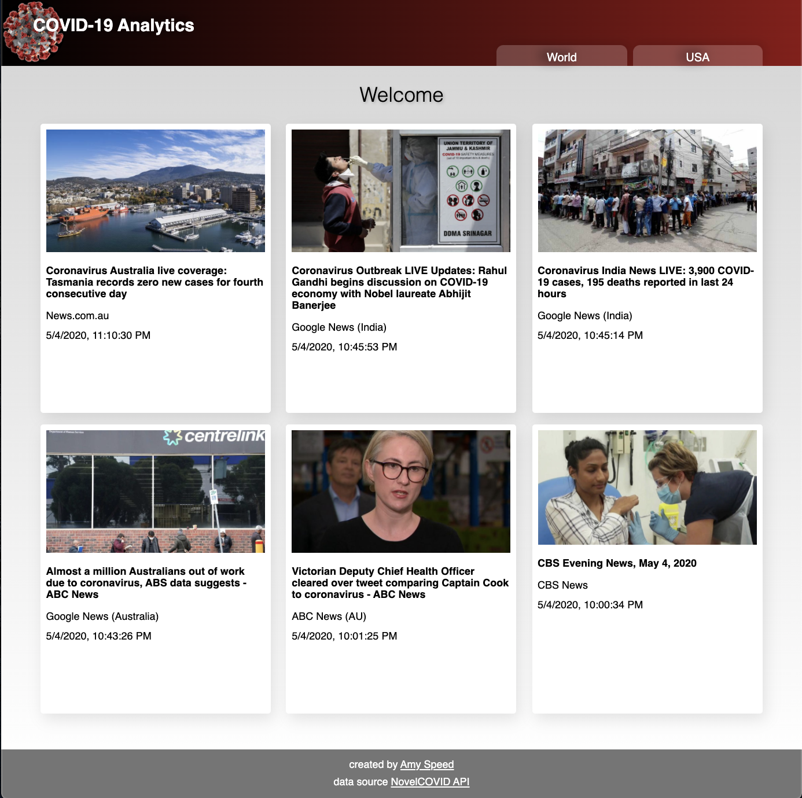
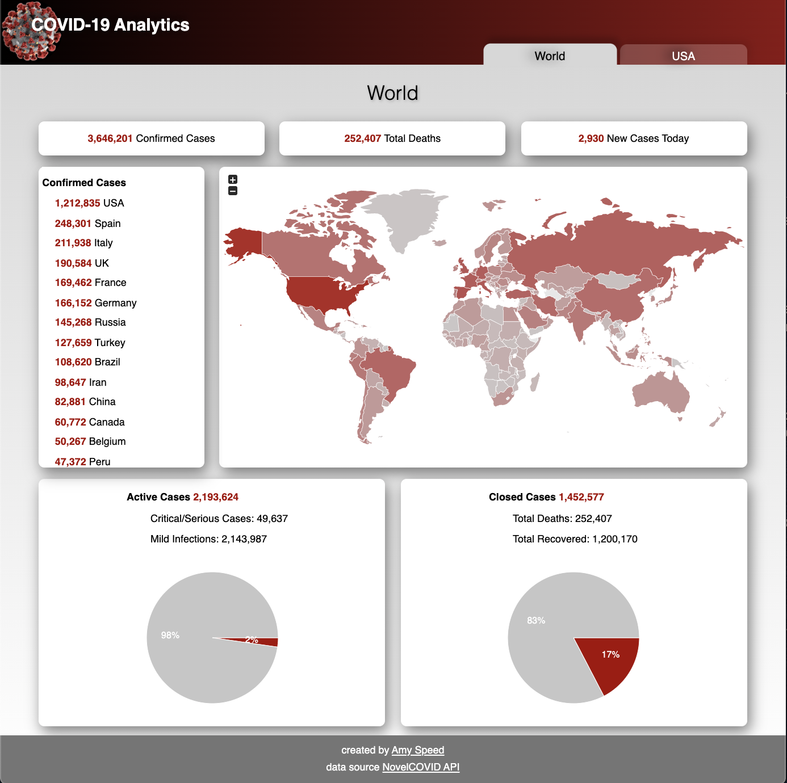
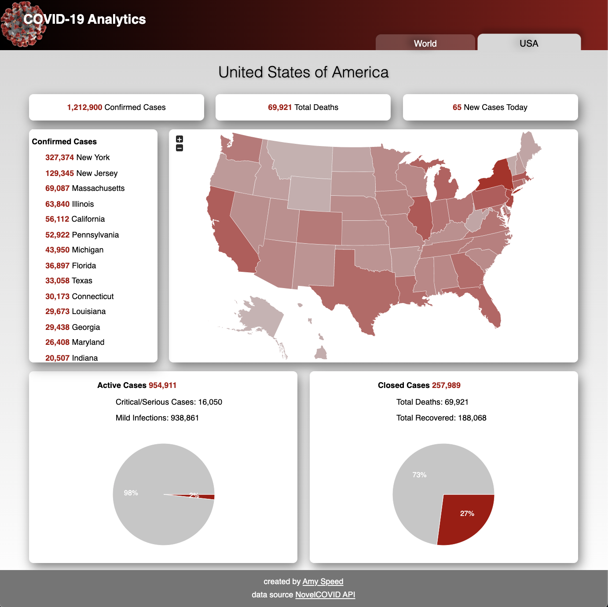

# COVID-19
An analytics dashboard with live COVID-19 Statistics

Created as a fun front end project during the Austin, TX "Shelter-in-place" order.

**View Live: [https://covid-19.amyspeed.dev](https://covid-19.amyspeed.dev)**

## Landing



## World



## USA



## Technologies
* React
* CSS
* React Router Dom
* Redux

## 3RD Party APIs
* [Novel COVID API](https://corona.lmao.ninja)
* [News API](https://newsapi.org)
* [Recharts](https://recharts.org/en-US/)
* [JVectorMap](https://jvectormap.com)

## Notes to self regarding deployment
This project is hosted with github pages using a custom DNS. DNS records are managed by Google Domains.

**After every commit:**
* Push changes to master

   ``` git push ```
* Make changes live on pages

   ``` npm run deploy ```
* Change custom domain in "settings"

   1. Go to settings
   2. Enter covid-19.amyspeed.dev in the custom domain prompt and SAVE
   3. Make sure the box is checked for Enforce HTTPS


